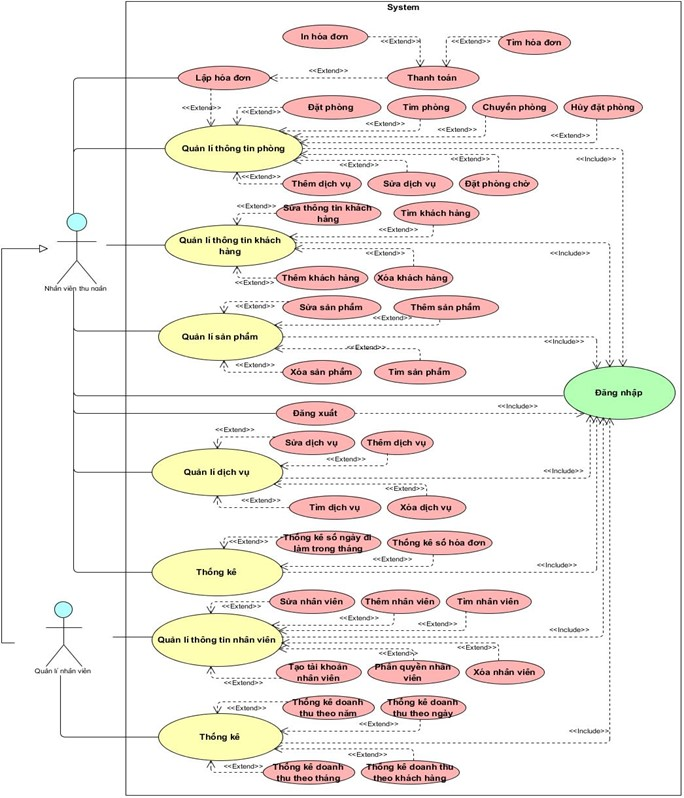
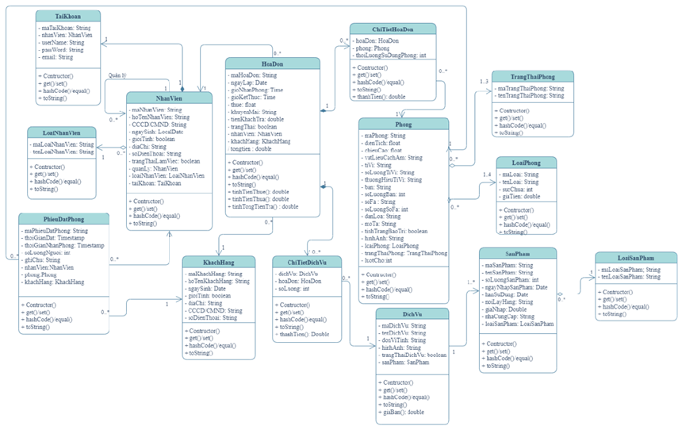
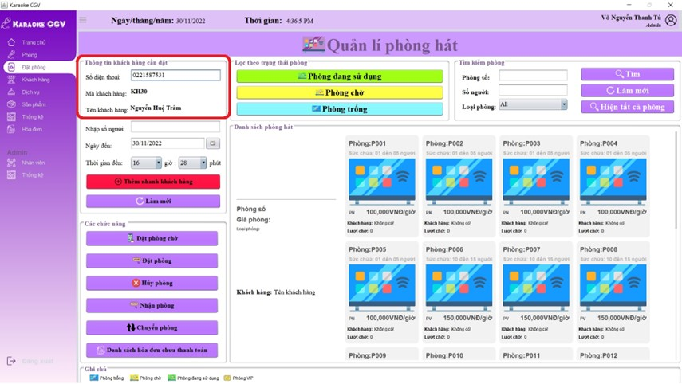
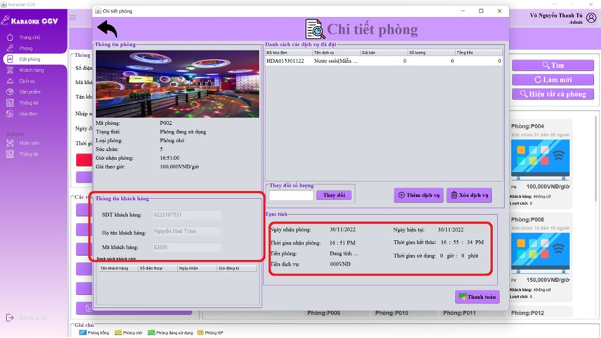
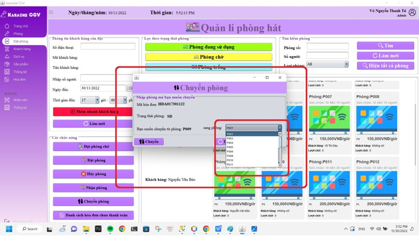
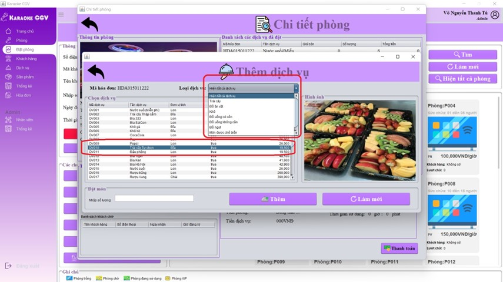
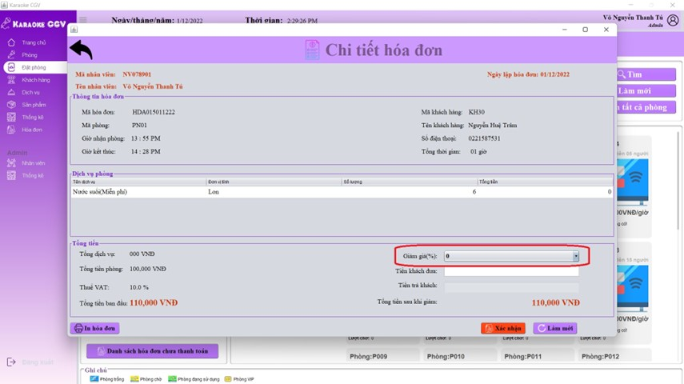
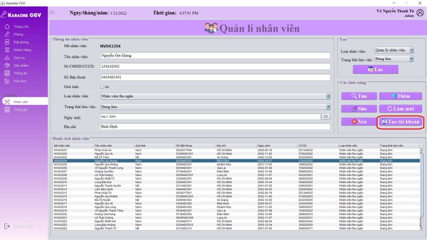

# Order-Manager-System

## Project Description:
A karaoke restaurant management application assists cashiers in easily handling tasks related to room booking and return management, room searching, adding new customers, editing customer information, and tracking loyal customers for convenient monitoring of customer benefits.
Additionally, the application helps managers by simplifying employee management tasks such as adding employees, editing employee information, and retrieving employee details (personal information, working hours).

## Languges:
Java(Swing)

## Databases
SQL Server

## Usecase diagrams:

## Class diagrams:

## Serveral features:

